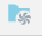
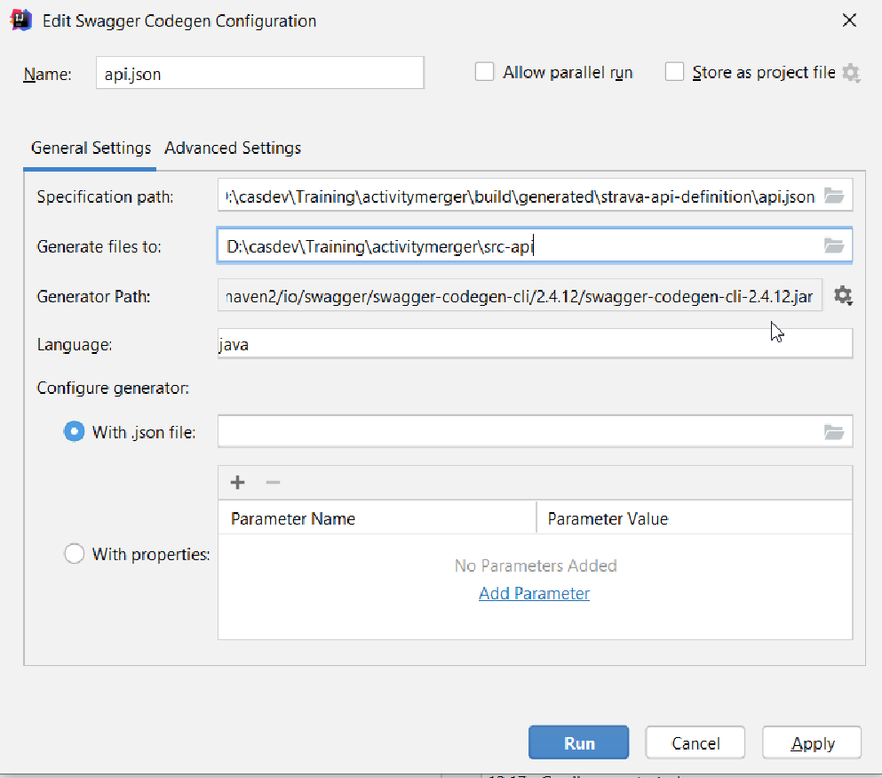
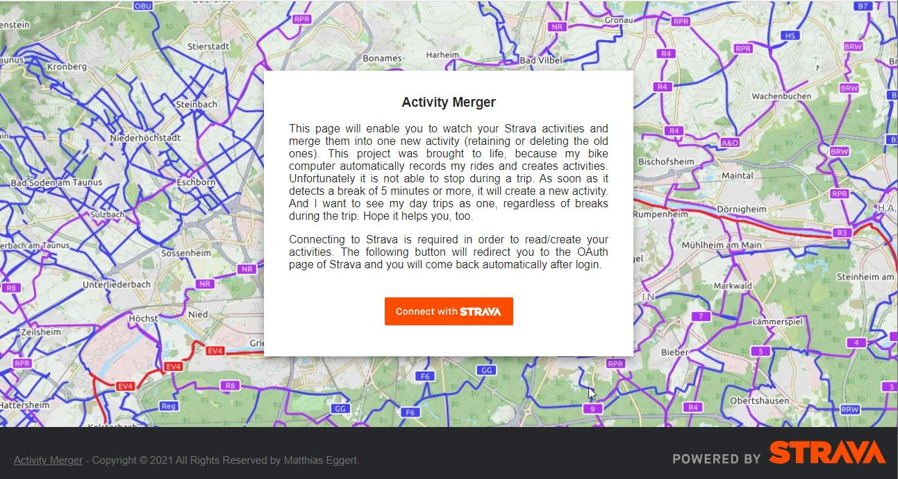
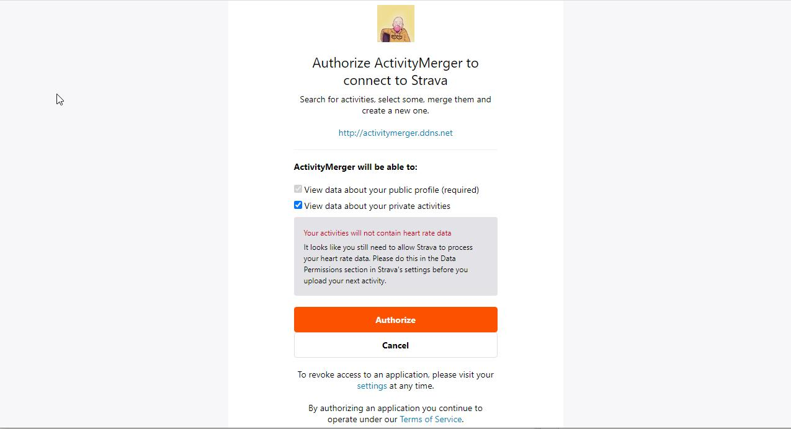
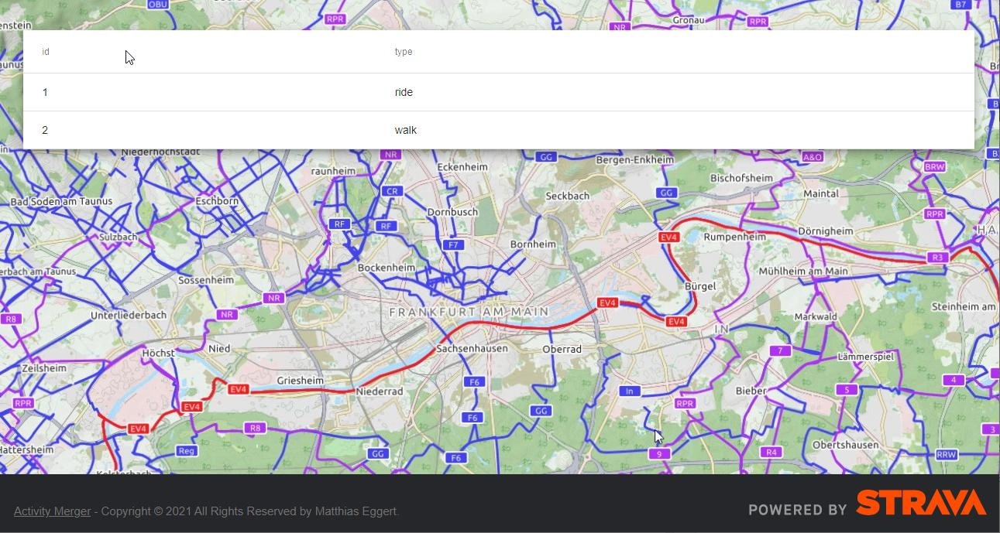

= Setup

== Get Strava API specification

To get the spec, simply run the Gradle task `downloadStravaApi`. You can do this either directly in IntelliJ or with `./gradlew downloadStravaApi` on command line.

== Generate OpenAPI client code

Unfortunately the Groovy support is really poor for Swagger/OpenAPI, so it's required to generate Java code. But since it is generated  code and shall not be touched, it doesn't really  matter.
To generate use the IntelliJ plugin. Simply open `build/generated/strava-api-definition/api.json` and in the Editor click on the edit button:



And there set the settings as below:



It is important to choose the correct path (according to gradle settings it is `src-api`) and to set the correct generator version --> The generator will be downloaded automatically.

OR! just run Gradle task `build` to get everything properly generated.

== Install NodeJS

In order to run the Angular frontend, you need to install NodeJS from https://nodejs.org/en/download/

= run it

For local purpose no special deployment is required.

But you need a secret file (`src/main/resources/.secrets`) with content which is not allowed to be shared:

```JSON
{
    "client_id": "<your id>",
    "client_secret": "<your client secret>"
}
```

Just run:

* `./gradlew bootRun` to start the backend services
* `cd web-app` and `ng serve --open` to open the web UI in your browser

Done.

= Strava API

include::docs/api/index.adoc[]

= How it looks




and the following page is currently only loading recent activities into a table, but does not have any details nor merge capabilities

